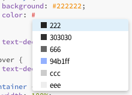

#colorHints
> Add already used hex colors to autocompletion to have quick access to your color palette

When you write CSS you may use many different colors. After some time of designing you have enough colors and just want to use these colors at some point again. But then you have to search for that element with that color, copy the color, find the spot again, where you wanted to insert it, ... and maybe it was the wrong color...

**That was the reason for creating colorHints!**

colorHints scans your current CSS file for colors in hexadecimal notation. When you insert a '#' for inserting a color it shows you all used colors in your document.

colorHints organizes your colors in two ways:

1. It sorts your colors by their brightness *(dark to bright)*
2. It shortens colors if possible *(see screenshot: #222222 becomes #222)*



##How to use

1. Open a *CSS*, *SCSS* or *LESS* file
2. Work with it
3. Press **#** to insert a hex color
4. **Tadaaaaaa! :D**

##How to install
There are three possible ways:

1. Install the extension via the Extension Manager in Brackets: ```File -> Extension Manager -> search for 'colorHints'```
2. Copy the url of this repository and paste it into ```File -> Extension Manager -> Install from URL```
3. [Download the code](https://github.com/konstantinkobs/brackets-colorHints/archive/master.zip) and extract it to the Extensions Folder: ```Help -> Show Extension Folder -> user```

##The MIT License (MIT)

Copyright (c) 2014 Konstantin Kobs

Permission is hereby granted, free of charge, to any person obtaining a copy
of this software and associated documentation files (the "Software"), to deal
in the Software without restriction, including without limitation the rights
to use, copy, modify, merge, publish, distribute, sublicense, and/or sell
copies of the Software, and to permit persons to whom the Software is
furnished to do so, subject to the following conditions:

The above copyright notice and this permission notice shall be included in
all copies or substantial portions of the Software.

THE SOFTWARE IS PROVIDED "AS IS", WITHOUT WARRANTY OF ANY KIND, EXPRESS OR
IMPLIED, INCLUDING BUT NOT LIMITED TO THE WARRANTIES OF MERCHANTABILITY,
FITNESS FOR A PARTICULAR PURPOSE AND NONINFRINGEMENT. IN NO EVENT SHALL THE
AUTHORS OR COPYRIGHT HOLDERS BE LIABLE FOR ANY CLAIM, DAMAGES OR OTHER
LIABILITY, WHETHER IN AN ACTION OF CONTRACT, TORT OR OTHERWISE, ARISING FROM,
OUT OF OR IN CONNECTION WITH THE SOFTWARE OR THE USE OR OTHER DEALINGS IN
THE SOFTWARE.